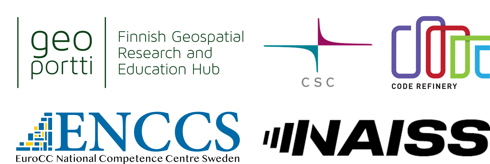

Snakemake Hackathon
====================

.. info::
   Materials for `Snakemake hackathon <https://ssl.eventilla.com/snakemake_hack>`_ organized on 22.05.24. Licensed under CC-BY-4.0 license.

.. prereq::

   - Depends on expected outcome; If needed, please read this material as supercomputing concept refresher: https://coderefinery.github.io/TTT4HPC_resource_management/# (If you are interested, also check the rest of the materials from "Tuesdays Tools and Techniques for HPC" (it is quite useful for daily working on clusters): https://scicomp.aalto.fi/training/scip/ttt4hpc-2024/)
   - Supercomputer access

.. toctree::
   :maxdepth: 1
   :caption: Materials

   Snakemake_intro.md
   Snakemake_HPC.md
   Hackathon.md

.. toctree::
   :maxdepth: 1
   :caption: Reference

.. _learner-personas:

About the course
-----------------

Snakemake is a common entry tool in the world of computational workflows, especially in Bioinformatics. 

The tool is designed to support you in setting up a workflow system, which opposed to a "your favorite language here" script, helps you keep track of your processes.

For Snakemake, the user has to define inputs and outputs and the tool will figure out the order of steps and which steps can be run in parallel. 

This Hackathon is open for all, free of charge and independent of field of Science and it is all about getting your own workflows to the supercomputer (Puhti, Mahti, Lumi or other).
 
Content
--------

We will offer short introduction to snakemake and a supercomputing concepts refresher session in the beginning, which you can attend if needed.

Then we will talk about opportunities and challenges with moving workflows from laptop to the supercomputer and give tips on how to go about it. 

The afternoon is reserved for your own work. You can either work on your own "Snakefile", moving your workflow from laptop to supercomputer or work on our toy example, to help understand the concepts better before moving to your own work. 

Learning outcomes
------------------

After this course, participants will be able to...

- Understand what is snakemake
- Decide if using Snakemake fits their workflow
- Implement own workflow with Snakemake
- Move own workflow to the supercomputer

See also
--------

- `CSC bio workflows with Nextflow course materials <https://a3s.fi/swift/v1/AUTH_53f5b0ae8e724b439a4cd16d1237015f/csc-training/workflows_workshop.html>`_
- `CSC workflows on HPC considerations - slides <https://a3s.fi/2001659-workflow-workshop/workflows.html#/>`_
- `CSC High Throughput Computing docs page <https://docs.csc.fi/computing/running/throughput/>`_
- `Uppsala snakemake BYOC <https://github.com/NBISweden/workshop-snakemake-byoc>`_
- `Snakemake tutorial <https://slides.com/johanneskoester/snakemake-tutorial>`_
- `CodeRefinery lesson <https://coderefinery.github.io/reproducible-research/workflow-management/>`_
- `Carpentries lesson <https://carpentries-incubator.github.io/workflows-snakemake/>`_
- `Snakemake workflows catalog <https://snakemake.github.io/snakemake-workflow-catalog/>`_
- `CSC Snakemake tutorial <https://docs.csc.fi/support/tutorials/snakemake-puhti/>`_
- `MultiXScale Workflows material <https://ocaisa.github.io/hpc-workflows/>`_
- `Universe HPC Snakemake lesson <https://github.com/UNIVERSE-HPC/course-material/tree/main/technology_and_tooling%2Fsnakemake>`_
